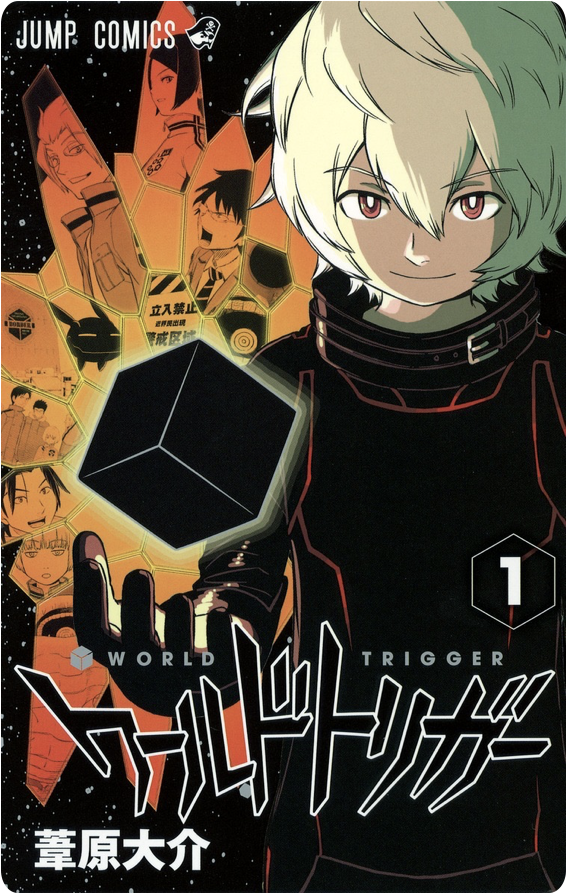

# 題材: 「漫画：ワールドトリガー」

### ワールドトリガーとは？

月刊ジャンプスクエアで月刊連載さいれている SF バトル漫画。
元々週刊少年ジャンプで連載されていたが、作者持病のため月刊ジャンプスクエアに移籍。

- [アニメ公式サイト](https://www.toei-anim.co.jp/tv/wt)
- [漫画１話](https://shonenjumpplus.com/episode/10833519556325021821)



### 選出理由

この課題では取引先責任者が人間でなければならない、何かしら組織に所属しているなど、テーマは自由に見えて割と制約がある印象だった。
その中で、ワールドトリガーは登場人物も多く、取引先・取引先責任者に宛てがう材料に困らないため選択。

## 取引先と取引先責任者にレコード登録

### 取引先

「〜隊」という名前でレコードを登録。要はワールドトリガーにおけるチームで、1 編成あたり 4〜5 名のメンバーが所属します。

### 取引先責任者

チームに所属するメンバーです。トリガーと呼ばれる武器を使い、悪い連中から街を守るために戦います。研鑽として隊員同士でバトルするランクマッチなどがあります。

用語補完

| 用語       | 概要                                                                                                                     |
| ---------- | ------------------------------------------------------------------------------------------------------------------------ |
| トリオン   | ワールドトリガーの世界における、重要な才能の一つ。後述するトリオン体やトリガーという武器の構築の源になります。           |
| トリオン体 | 隊員は、トリオン体というトリオンで構築された戦闘体に換装し、戦います。トリオンでしかダメージを与えらません。             |
| トリガー   | トリオンから作られる、いわゆる武器です。現実世界でいう銃火器や刀、盾だと考えてください。隊員は好きな武器を選択できます。 |

## カスタム項目

下記のオブジェクトにカスタムフィールドを追加

### 取引先

| ラベル | 項目名      | データ型   | 概要                                           |
| ------ | ----------- | ---------- | ---------------------------------------------- |
| 所属   | Branch\_\_c | 選択リスト | チーム（取引先）が、所属する支社・部門を表す。 |

### 取引先責任者

| ラベル             | 項目名               | データ型    | 概要                                                                                                 |
| ------------------ | -------------------- | ----------- | ---------------------------------------------------------------------------------------------------- |
| 総保有ソロポイント | TotalSoloPoint\_\_c  | 数値（6,0） | 個人ランク付けに使用されるポイント                                                                   |
| お気に入りトリガー | FavoriteTrigger\_\_c | 選択リスト  | 各隊員が得意なトリガー(武器)                                                                         |
| ポジション         | Position\_\_c        | 選択リスト  | 狙撃銃が得意な人は「スナイパー」、近接武器が得意な隊員は「アタッカー」など、隊員のポジションを表す。 |

## カスタムオブジェクト

- ### ソロ対戦結果（SoloMatchResult\_\_c）
  ソロ対戦の結果、誰にいくら獲得ポイントが入ったのかを表すレコード

| ラベル             | 項目名                  | データ型                      | 概要                                                                   |
| ------------------ | ----------------------- | ----------------------------- | ---------------------------------------------------------------------- |
| ソロ対戦結果名     | Name                    | テキスト(80)                  | 対戦に名前をつける必要はなく、自動採番の方が望ましいと後から気がついた |
| 作成者             | CreatedBy               | 参照関係（ユーザー）          |                                                                        |
| 所有者             | OwnerId                 | 参照関係（ユーザー,グループ） |                                                                        |
| 最終更新者         | LastModifiedById        | 参照関係(ユーザー)            |                                                                        |
| 挑戦者             | Challenger\_\_c         | 参照関係(取引先責任者)        | 対戦を申し込んだ取引先責任者                                           |
| 挑戦者獲得ポイント | PointForChallenger\_\_c | 数値(3、0                     | 挑戦者の獲得ポイント。最大 3 桁                                        |
| 対戦者             | Opponent\_\_c           | 参照関係（取引先責任者）      | 対戦相手となる、取引先責任者                                           |
| 対戦者獲得ポイント | PointForOpponent\_\_c   | 数値(3、0)                    | 獲得ポイント。最大 3 桁                                                |

### 実装したかったが、時間的に実装できなかったカスタムオブジェクト

- ソロポイント詳細
  - → トリガーごとにポイントが加算される仕様があることを表現するため
- ランクマッチ結果
  - → 取引先、というよりチームごとの順位づけをするための対戦がある。その試合結果を格納する
- ランクマッチメンバー成績
  - → ランクマッチで発生した、具体的なポイント配分を格納するもの。

## apex トリガー実装

### ソロ対戦結果のレコードが INSERT 時、挑戦者獲得ポイント・対戦者獲得ポイントが、それぞれ取引先責任者の総保有ソロポイントに加算される

- 対戦でのポイント変動を表現するために実装。実装クラスは下記
- `force-app/main/default/triggers/UpdateSoloPointBySoloRankMatch.trigger`

コンソールでの再現方法

1. ログイン
2. 「ソロ対戦結果」タブをクリック
3. 「新規」ボタンをクリックし、レコード作成（必須項目は全て埋める）
4. 挑戦者に指定した取引先責任者に挑戦者獲得ポイントが、対戦者に指定した取引先責任者に対戦者獲得ポイントが、総保有ソロポイントに加算される


## 工夫したこと

- 工夫というレベルではないが、開発者コンソールが使いにくいため VSCode で編集できるようにした
- Java と微妙に文法が異なる部分など、間違えたことに気がつきにくい部分（変数参照にコロンをつける等）は、ChatGPT に聞くなりして解決した。
- カスタム項目、カスタムオブジェクトの設計は、DB 設計のように ER 図を書いた


## 苦労したこと

Apex トリガー設定するにあたり、Apex クラスなどわからぬ項目は多く不明点が多かったこと。それらは下記の Trailhead で知識のインプットを行った。

- [Apex の基本とデータベース](https://trailhead.salesforce.com/ja/content/learn/modules/apex_database)
- [クイックスタート: Apex](https://trailhead.salesforce.com/ja/content/learn/projects/quickstart-apex)

## もっとやりたかったこと

- ソロランクバトルのレコード INSERT 時、トリガーごとにポイントを記録するカスタムオブジェクトを INSERT するものを作りたかった
- 作成した Apex トリガーに対するテストクラスを作りたかった。作ってみたが解決前にリミットがきてしまい、諦めてプロダクトコードが動くことを優先した
- テスト実行時、以下のエラーから抜けられなかった

```shell
This class name's value is invalid: UpdateSoloPointBySoloRankMatchTest. Provide the name of an Apex class that has test methods.
```

- 処理を安全にするロジックを組み込みたかった（現状、ソロポイント加算処理時、取引先責任者の総保有ソロポイントが NULL だとエラーが起こると思われる。）
